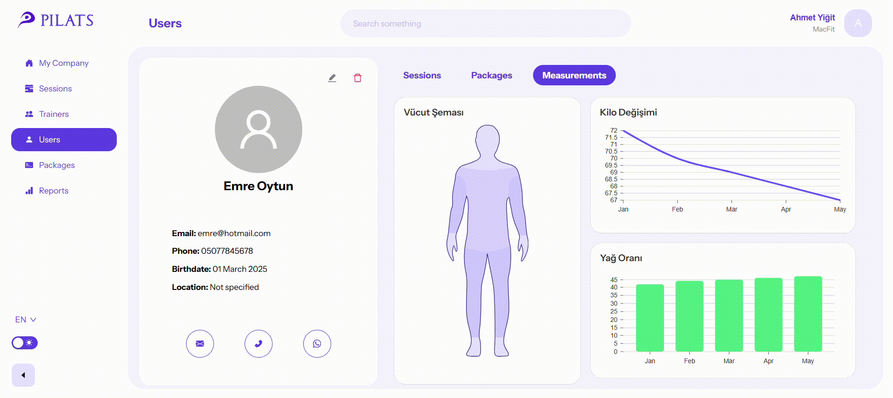

# 🏋️‍♀️ PILATS – Your Gym Body

PILATS is a modern and comprehensive gym management system designed to streamline the daily operations of gyms. It offers an all-in-one solution accessible via web and mobile platforms for administrators, trainers, and customers to efficiently manage users, schedules, sessions, and health data.

## 🚀 Features

- 🌐 **Web Panel:** For Admins, Company Admins, and Branch Admins to manage users, trainers, customers, packages, and sessions.
- 📱 **Mobile App (Flutter):** Enables trainers and customers to view sessions, make reservations, track health metrics, and use QR codes for check-ins.
- 🔐 **Role-Based Access:** Ensures secure and limited access based on user roles.
- 📦 **Package Management:** Define and assign personalized membership packages on a company or branch level.
- 🗓️ **Calendar & Scheduling:** Drag-and-drop calendar interface for trainers to plan sessions and for customers to book them easily.
- 📊 **Reporting:** Visual insights on user activity, health data, and package usage through integrated analytics dashboards.

---

## 🎥 Demo GIFs

Here are several demo GIFs showcasing the core features and interface of the application:

### 📅 Calendar Drag & Drop – Add Session

### 🧑‍🏫 Add Trainer – Form Flow

### 📊 Customer Dashboard – Health Metrics & Package Info

### 🌓 Dark Theme & Search Bar

---

## 🔗 Full Video Demo

Watch the full demonstration of the PILATS system on YouTube:

📺 [Click here to watch](https://www.youtube.com/watch?v=xDgxAK2ydxs)

---
