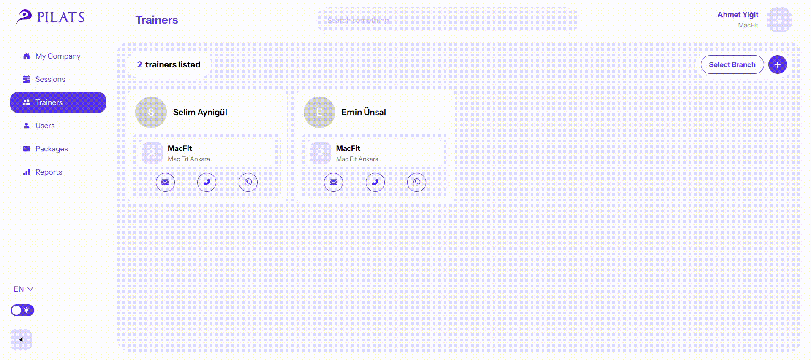
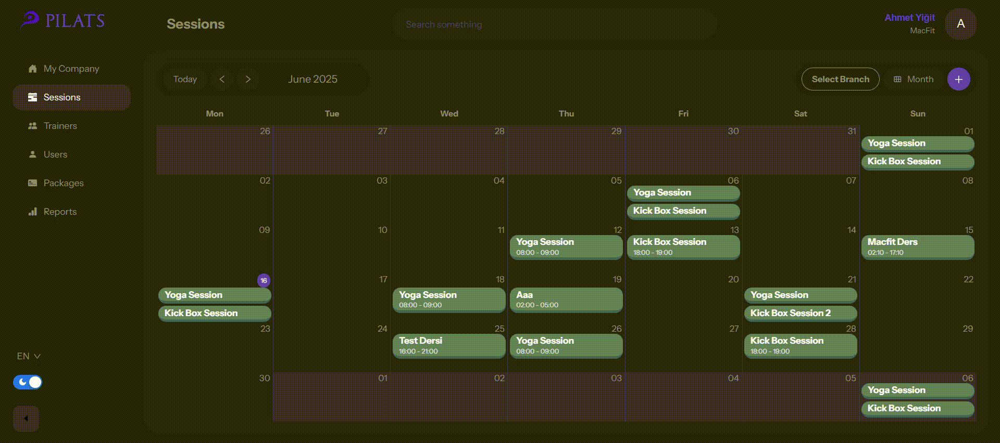

# 🏋️‍♀️ PILATS – Your Gym Body

PILATS, spor salonları için geliştirilen modern ve kapsamlı bir yönetim sistemidir. Web ve mobil platformlar üzerinden çalışan bu sistem, yöneticilerin, eğitmenlerin ve müşterilerin tüm süreçlerini tek bir çatı altında verimli bir şekilde yürütmesini sağlar.

## 🚀 Özellikler

- 🌐 **Web Paneli:** Admin, şirket yöneticisi ve şube yöneticileri için kullanıcı, eğitmen, müşteri, paket ve ders yönetimi.
- 📱 **Mobil Uygulama (Flutter):** Eğitmen ve müşteriler için ders görüntüleme, rezervasyon, sağlık verileri takibi ve QR ile giriş sistemi.
- 🔐 **Rol Tabanlı Erişim:** Her kullanıcının yalnızca kendi yetkileri dahilinde işlem yapabildiği güvenli mimari.
- 📦 **Paket Sistemi:** Şube ya da şirket seviyesinde müşteri bazlı özel paketler tanımlama ve yönetme.
- 🗓️ **Takvim & Planlama:** Eğitmenlerin derslerini planlaması ve müşterilerin kolayca katılım sağlaması için sürükle-bırak takvim sistemi.
- 📊 **Raporlama:** Kullanıcı aktiviteleri, sağlık verileri ve paket kullanımı gibi birçok metrik üzerinde grafik destekli analiz.

---

## 🎥 Demo GIFs

Aşağıda uygulamaya ait çeşitli arayüzlerin ve özelliklerin tanıtım GIF'lerini bulabilirsiniz.

### 📅 Takvim Üzerinde Sürükle-Bırak ile Ders Ekleme

### 🧑‍🏫 Eğitmen Ekleme – Form Süreci

### 📊 Müşteri Paneli – Sağlık Verileri ve Paket Bilgisi

### 🌓 Dark Theme & Search Bar

---

📌 **Not:** GIF dosyalarının `./assets/` dizininde yer aldığından emin olun. Eğer başka bir konumdaysa, yol bilgisini güncellemeniz yeterlidir.
